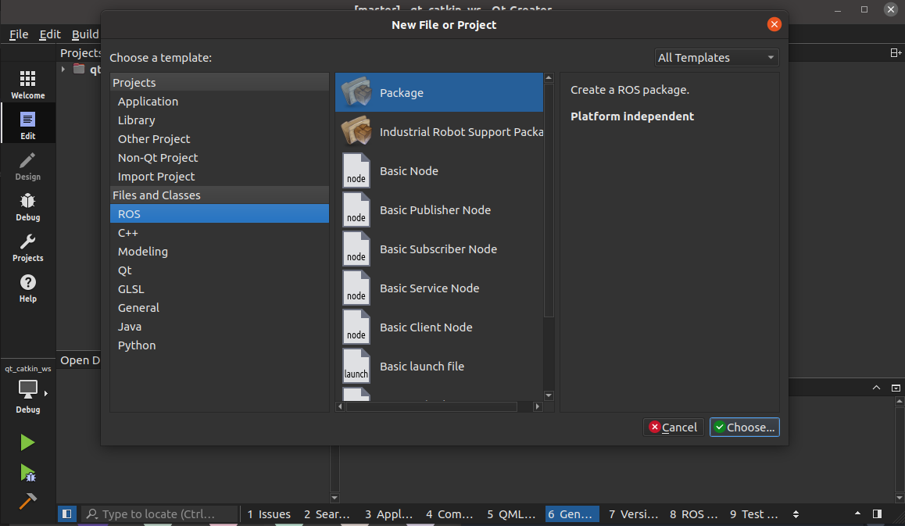

#  ROS-and-Qt

September 16, 2020

Editors:

* Andrea Gotelli

Tutorial for combining ROS with the IDE Qt Creator (in Ubuntu 20.04). This document in mainly a
copy and paste of tutorials from internet (mostly from Slack and ROS Wiki). However, there
are some small changes from what is written in the online tutorial and what we have to do; mostly
because some tutorials are out of date.

The information contained here allow the infamous practice of spending
hours figuring out the right tutorial to follow. It mostly comes out of experience and not very friendly mistakes. If you have any suggestion please feel free to modify this document and open and issue.

## Index

* [Introduction](#S-Introduction)
* [Installing ROS2](#S-IROS2)
* [Installing Colcon](#S-Col)
* [Initializing Colcon workspace](#S-WSR2)
* [Installing ROS1](#S-IROS1)
* [Installing Catkin](#S-ICATKIN)
* [Initializing Catkin workspace](#S-ICATKINWS)
* [Setup Qt Creator](#S-SETUPQT)

# Introduction

This file aim to explain how to create four workspace. The interest in that is
of having two workspace dedicated to Qt Creator (with all the advantages an
IDE can bring in this context) but having two other workspace in the "classical" configuration (which means the code inside must be edited with a
common editor).

Moreover, the two extra "classic workspace" may be used to keep stable and
finished packages, keeping the workspace with work in progress packages lighter.

# Installing ROS2
First install the newest version of ROS2 (which is foxy at the time of this document)
To do so, here are reported the steps of the official website: https://index.ros.org/doc/ros2/Installation/Foxy/Linux-Install-Debians/

## Locale

Make sure you have a locale which supports UTF-8. If you are in a minimal environment (such as a docker container), the locale may be something minimal like POSIX. We test with the following settings. However, it should be fine if you’re using a different UTF-8 supported locale.

      locale  # check for UTF-8

      sudo apt update && sudo apt install locales
      sudo locale-gen en_US en_US.UTF-8
      sudo update-locale LC_ALL=en_US.UTF-8 LANG=en_US.UTF-8
      export LANG=en_US.UTF-8

      locale  # verify settings

## Setup Sources

You will need to add the ROS 2 apt repositories to your system. To do so, first authorize our GPG key with apt like this:

    sudo apt update && sudo apt install curl gnupg2 lsb-release
    curl -s https://raw.githubusercontent.com/ros/rosdistro/master/ros.asc | sudo apt-key add -

And then add the repository to your sources list:

    sudo sh -c 'echo "deb [arch=$(dpkg --print-architecture)] http://packages.ros.org/ros2/ubuntu $(lsb_release -cs) main" > /etc/apt/sources.list.d/ros2-latest.list'

## Install ROS 2 packages

Update your apt repository caches after setting up the repositories.

    sudo apt update

In the case there are some packages that are not up to date run:

    sudo apt upgrade

Desktop Install (Recommended): ROS, RViz, demos, tutorials.

    sudo apt install ros-foxy-desktop

## Environment setup, Sourcing the setup script

Set up your environment by sourcing the following file.

    source /opt/ros/foxy/setup.bash

## Install argcomplete

ROS 2 command line tools use argcomplete to autocompletion. So if you want autocompletion, installing argcomplete is necessary.

    sudo apt install -y python3-pip
    pip3 install -U argcomplete

## Try some examples

In one terminal, source the setup file and then run a C++ talker:

    source /opt/ros/foxy/setup.bash
    ros2 run demo_nodes_cpp talker

In another terminal source the setup file and then run a Python listener:

    source /opt/ros/foxy/setup.bash
    ros2 run demo_nodes_py listener

You should see the talker saying that it’s Publishing messages and the listener saying I heard those messages. This verifies both the C++ and Python APIs are working properly. Hooray!

# Installing Colcon

Then you need to install Colcon from the website: https://colcon.readthedocs.io/en/released/user/installation.html#quick-directory-changes

The correct procedure is presented below.

    sudo sh -c 'echo "deb [arch=amd64,arm64] http://repo.ros2.org/ubuntu/main `lsb_release -cs` main" > /etc/apt/sources.list.d/ros2-latest.list'
    curl -s https://raw.githubusercontent.com/ros/rosdistro/master/ros.asc | sudo apt-key add -

After that you can install the Debian package which depends on colcon-core as well as commonly used extension packages (see setup.cfg).

    sudo apt update
    sudo apt install python3-colcon-common-extensions

# Initializing Colcon workspace

At this point it is necessary to configure the ROS2 environment. It is better to follow the
step in the website: https://index.ros.org/doc/ros2/Tutorials/Configuring-ROS2-Environment/ and https://index.ros.org/doc/ros2/Tutorials/Colcon-Tutorial/
In this last point, it is more convenient not to modify the .bashr file, as we want to deal
with multiple ROS versions. The sufficient steps are reported below.

## Quick Introduction
ROS 2 relies on the notion of combining workspaces using the shell environment. “Workspace” is a ROS term for the location on your system where you’re developing with ROS 2. The core ROS 2 workspace is called the underlay. Subsequent local workspaces are called overlays. When developing with ROS 2, you will typically have several workspaces active concurrently.

Combining workspaces makes developing against different versions of ROS 2, or against different sets of packages, easier. It also allows the installation of several ROS 2 distributions (or “distros”, e.g. Dashing and Eloquent) on the same computer and switching between them.

This is accomplished by sourcing setup files every time you open a new shell, or by adding the source command to your shell startup script once. Without sourcing the setup files, you won’t be able to access ROS 2 commands, or find or use ROS 2 packages. In other words, you won’t be able to use ROS 2.

## Tasks

###### 1 Source the setup files

You will need to run this command on every new shell you open to have access to the ROS 2 commands, like so:

    source /opt/ros/foxy/setup.bash

###### 2 Check environment variables

Sourcing ROS 2 setup files will set several environment variables necessary for operating ROS 2. If you ever have problems finding or using your ROS 2 packages, make sure that your environment is properly setup using the following command:

    printenv | grep -i ROS

Check that variables like ROS_DISTRO and ROS_VERSION are set. For example, if you’re using Foxy, you would see:

    ROS_VERSION=2
    ROS_PYTHON_VERSION=3
    ROS_DISTRO=foxy

If the environment variables are not set correctly, return to the ROS 2 package installation section of the installation guide you followed.

###### 3 Install Colcon

Now we can create our workspace and git clone some examples.

Colcon is an iteration on the ROS build tools catkin_make, catkin_make_isolated, catkin_tools and ament_tools.

To install colcon run the following

    sudo apt install python3-colcon-common-extensions

###### 4 Basics of a Workspace

A ROS workspace is a directory with a particular structure. Commonly there is a src subdirectory. Inside that subdirectory is where the source code of ROS packages will be located. Typically the directory starts otherwise empty.

colcon does out of source builds. By default it will create the following directories as peers of the src directory:

    The build directory will be where intermediate files are stored. For each package a subfolder will be created in which e.g. CMake is being invoked.

    The install directory is where each package will be installed to. By default each package will be installed into a separate subdirectory.

    The log directory contains various logging information about each colcon invocation.

Note

Compared to catkin there is no devel directory.

###### 5 Creating the Workspace

First, create a directory (colcon_ws) to contain our workspace:

mkdir -p ~/colcon_ws/src
cd ~/colcon_ws

At this point the workspace contains a single empty directory src:

.
└── src

1 directory, 0 files

###### 6 Add some sources

Let’s clone the examples repository (opening a new terminal into the src directory of the workspace):

git clone https://github.com/ros2/examples examples

Attention

It is recommended to checkout a branch that is compatible with the version of ROS that was installed.

cd examples/
git checkout foxy
cd ~/colcon_ws

Now the workspace should have the source code to the ROS 2 examples:

.
└── src
    └── examples
        ├── CONTRIBUTING.md
        ├── LICENSE
        ├── rclcpp
        ├── rclpy
        └── README.md

4 directories, 3 files

###### 7 Build the workspace

In the root of the workspace, run colcon build. Since build types such as ament_cmake do not support the concept of the devel space and require the package to be installed, colcon supports the option --symlink-install. This allows the installed files to be changed by changing the files in the source space (e.g. Python files or other not compiled resourced) for faster iteration.

    colcon build --symlink-install

After the build is finished, we should see the build, install, and log directories:

.
├── build
├── install
├── log
└── src

4 directories, 0 files

###### 8 Run tests

To run tests for the packages we just built, run the following:

    colcon test

###### 9 Source the environment

When colcon has completed building successfully, the output will be in the install directory. Before you can use any of the installed executables or libraries, you will need to add them to your path and library paths. colcon will have generated bash/bat files in the install directory to help setup the environment. These files will add all of the required elements to your path and library paths as well as provide any bash or shell commands exported by packages.

    . install/setup.bash

This last command is the same as "source devel/setup.bash" but in the colcon workspace there is not
a devel folder.

###### 10 Try a demo

With the environment sourced we can run executables built by colcon. Let’s run a subscriber node from the examples:

    ros2 run examples_rclcpp_minimal_subscriber subscriber_member_function

In another terminal, let’s run a publisher node (don’t forget to source the setup script):

    ros2 run examples_rclcpp_minimal_publisher publisher_member_function

You should see messages from the publisher and subscriber with numbers incrementing.

Now a working ROS2 invironment is ready. In the following the installation of ROS1 is discussed.

# Installing ROS1
In the following are reported the needed steps from the official website: http://wiki.ros.org/noetic/Installation/Ubuntu

###### 1 Setup your sources.list

Setup your computer to accept software from packages.ros.org.

    sudo sh -c 'echo "deb http://packages.ros.org/ros/ubuntu $(lsb_release -sc) main" > /etc/apt/sources.list.d/ros-latest.list'

Set up your keys

    sudo apt-key adv --keyserver 'hkp://keyserver.ubuntu.com:80' --recv-key C1CF6E31E6BADE8868B172B4F42ED6FBAB17C654

If you experience issues connecting to the keyserver, you can try substituting hkp://pgp.mit.edu:80 or hkp://keyserver.ubuntu.com:80 in the previous command.

Alternatively, you can use curl instead of the apt-key command, which can be helpful if you are behind a proxy server:

    curl -sSL 'http://keyserver.ubuntu.com/pks/lookup?op=get&search=0xC1CF6E31E6BADE8868B172B4F42ED6FBAB17C654' | sudo apt-key add -

###### 2 Installation

First, make sure your Debian package index is up-to-date:

    sudo apt update

Again, in the case there are some packages not up to date, run: sudo apt upgrade

Desktop-Full Install: (Recommended) : Everything in Desktop plus 2D/3D simulators and 2D/3D perception packages

    sudo apt install ros-noetic-desktop-full

###### 3 Environment setup

You must source this script in every bash terminal you use ROS in.

    source /opt/ros/noetic/setup.bash

# Installing Catkin

Once ROS Noetic is installed it is time to install Catkin. This last one has the same function of Colcon, so a quick installation is presented without too many explanations. The following was taken from: https://catkin-tools.readthedocs.io/en/latest/installing.html

First you must have the ROS repositories which contain the .deb for catkin_tools:

    sudo sh -c 'echo "deb http://packages.ros.org/ros/ubuntu `lsb_release -sc` main" > /etc/apt/sources.list.d/ros-latest.list'
    wget http://packages.ros.org/ros.key -O - | sudo apt-key add -

Once you have added that repository, run these commands to install catkin_tools:

    sudo apt-get update
    sudo apt-get install python3-catkin-tools

Then there is the need of solving some dependencies first. So run the following:

    sudo apt install python3-catkin-lint python3-pip
    pip3 install osrf-pycommon

# Initializing Catkin workspace

The procedure is taken from the website: http://wiki.ros.org/ROS/Tutorials/InstallingandConfiguringROSEnvironment

During the installation of ROS, you will see that you are prompted to source one of several setup.*sh files, or even add this 'sourcing' to your shell startup script. This is required because ROS relies on the notion of combining spaces using the shell environment. This makes developing against different versions of ROS or against different sets of packages easier.

If you are ever having problems finding or using your ROS packages make sure that you have your environment properly setup. A good way to check is to ensure that environment variables like ROS_ROOT and ROS_PACKAGE_PATH are set:

    printenv | grep ROS

If they are not then you might need to 'source' some setup.*sh files.

Let's create and build a catkin workspace:

    mkdir -p ~/catkin_ws/src
    cd ~/catkin_ws/
    catkin build

The catkin build command is a convenience tool for working with catkin workspaces.

At this point also the ROS1 workspace is done.

# Setup Qt Creator

Now the only thing remaining is to set up Qt. For that, download and follow the instruction at: https://ros-qtc-plugin.readthedocs.io/en/latest/

Or just follow the steps reported here.

##### 1 Install the Wizard

To install the wizard by downloading it from here or click the link:
    https://qtcreator-ros.datasys.swri.edu/downloads/installers/bionic/qtcreator-ros-bionic-latest-online-installer.run

Which obviously it is going to be a virus, designed to steal your precious Facebook account.

###### 2 Install the program

Right click on the downloaded file, go to permission and allow to be executed as a program. Then just follow the Wizard, it works just fine.

###### 3 Last steps

At this point, it is sufficient to follow the incoming steps which are a sum up of the videos linked below. The video are for set up the environment for ROS1 but the can be used in our case as well.
###### Video 1
    https://qtcreator-ros.datasys.swri.edu/downloads/tutorials/videos/introduction/(Part%202)%20ROS%20QT%20Intro%20-%20Import,%20Build,%20and%20Run%20Settings.mp4

###### Video 2
    https://qtcreator-ros.datasys.swri.edu/downloads/tutorials/videos/introduction/(Part%203)%20ROS%20QT%20Intro%20-%20Hello%20World!.mp4

###### Video 3
    https://qtcreator-ros.datasys.swri.edu/downloads/tutorials/videos/introduction/(Part%204)%20ROS%20QT%20Intro%20-%20Hello%20World!.mp4

###### Create the workspaces under Qt

In your home (or wherever you want) create a folder called qt_wss (stand for Qt workspaces).
Inside this folder create two others folder called catkin and colcon, both with and src inside.
At this point is possible to set up the environment.

###### Setup Catkin workspace
Inside the newly created catkin folder, first source the correct .bash file.

    source /opt/ros/noetic/setup.bash

At this point run the command catkin build (or catkin init). The advantages in using catkin tool
instead of catkin_make is that it solves the dependencies among packages automatically and has
less verbose.

At this point open the app Qt Creator. Click on New Project and then select ROS Workspace.
  

Check to have selected the Welcome button, then press on "+ New Project"

A window will pop up, selecting the "Other Project" you will found the option ROS Workspace.

  

Once have selection the ROS workspace, the following window pops up.

  

In this window you have to give a name to the project. I suggest to write the info that this is a workspace under Qt and based on Catkin.

There is a panel where to select the ROS version. Here select Noetic. For what concerns the Build System, choose CatkinBuild (as before we used catkin build to initialize the workspace).

The last thing remaining is to Browse the folder "qt_wss/catkin" and click Next. That will open the following window.

  

Here you can chose if initialie git (why not?) and then click on finish.

At this point the worst is done, you can click on build now to build the workspace with Qt.

  

You can enable a ROS terminal by clicking on the double triangles on the bottom left and selecting the related checkbox.

###### Setup Colcon workspace

This part follows the same procedure as for Catkin.

Inside the folder colcon (the one in qt_wss), first source the correct .bash file

    source /opt/ros/foxy/setup.bash

Then build the workspace running colcon build.

Opening Qt Creator, follow the same step as before but:
* Choose a reasonable project name (like qt_colcon_ws)
* Select the qt_wss/colcon folder
* Select foxy as ROS version
* Select Colcon as Build System

If everything goes right Qt will be able to build the workspace without problems.

######    Creating a package from Qt Creator

It is possible to create packages and nodes directly from Qt creator. However, this is possible only for ROS1 projects.

To do so, go to file, in the right upper corner, and "new file or project".

  

Selecting ROS in "Files and Classes" you are able to create a package, by selecting "Package". Clicking on next you will be prompted to a GUI which ask the same info as the command "catkin_create_package"

  

Clicking on "Next" the package is created in the selected workspace.

If you want to create a node there is already templates.

  

Selecting on the template you want you just have to give a name to your executable.

  

The procedure is not applicable in the colcon workspace. The reason is that the Qt plugin is for ROS1 not ROS2. As a result, for ROS2 you need to use the old fashion terminal.

The useful command are:

    source /opt/ros/foxy/setup.bash

    ros2 pkg create pkg_name

######  Define the ROS run command(s)

The last thing it remains to do is to set up the run configuration. In the left part of the application, select the wrench where is written "Project" and you will be prompted in the following page.

  

Select the run configurations and then change the "Run configuration" from "Custom Executable" to "ROS Run Configuration"

  

Now it is possible to set up one (or more) run command(s) as well as launch command, by adding the desired step.

  
